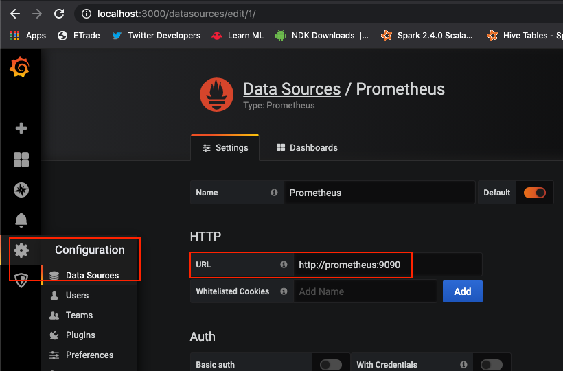

# Monitoring pipeline

## Docker Compose (dev local)

Just start with ```docker-compose up```

Monitoring

* Grafana : [http://localhost:3000/](http://localhost:3000/) (Login / Pwd : admin / admin)
* Prometheus : [http://localhost:9090/](http://localhost:9090/)
* Prometheus Targets : [http://localhost:9090/targets](http://localhost:9090/)

## Prometheus

### Node Exporter

ATTENTION **CONFIGURE YOUR OWN IP** AS LOCALHOST NOT SUPPORTED !!

Configure your spring application using :

```
  - job_name: 'spring-actuator'
    metrics_path: '/actuator/prometheus'
    scrape_interval: 5s
    static_configs:
	   - targets: ['x.y.z.v:8080']
```

### Troubleshooting

ATTENTION : docker node-exporter is pulling using local IP. You may need to check if the IP configured is correct in file [/infra/docker/prometheus/prometheus.yml](/infra/docker/prometheus/prometheus.yml)

Check if Prometheus Node-Exporter Dashboard at ```/targets``` url :

* From docker : [http://localhost:9090/targets](http://localhost:9090/targets)

If something is wrong, you can try to open the URL  yourself at ```http://x.y.z.v:8080/actuator/prometheus```


## Grafana Dashboard

### Add datasource

* Grafana : [http://localhost:3000/](http://localhost:3000/) (Login / Pwd : admin / admin)

Add datasource using Prometheus from Grafana **docker instance** configure access **using DNS** and not localhost !

* [http://prometheus:9090](http://prometheus:9090)




### Import Dashboard

Go to Dashboard > Manage > Import button :

* Type the ID for the desired dashboard (ex : ```4701```)
* Select the previously configured datasource
* Click import

Interesting dashboard :

* [JVM (Micrometer) - 4701](https://grafana.com/grafana/dashboards/4701)
* [Spring Boot 2.1 Statistics - 10280](https://grafana.com/grafana/dashboards/10280)
